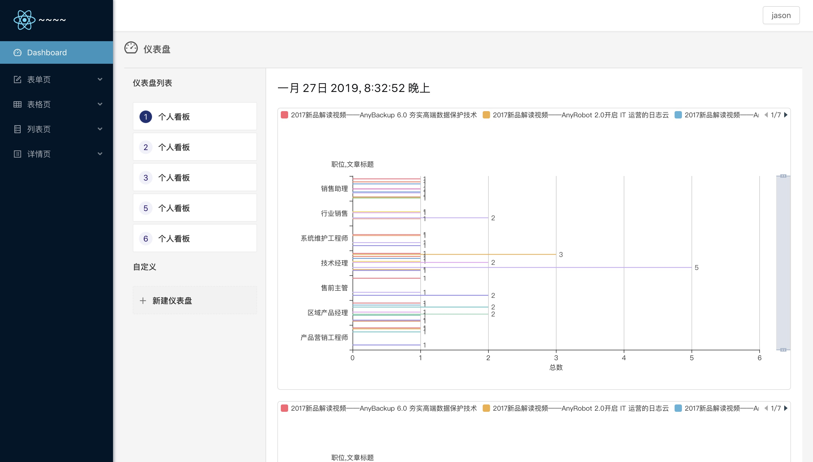

# mobx_antd_react

中后台 spa 完整项目脚手架。



## 写在前面

当前版本作出的优化项

- 修改项目文件组织结构
- 修改项目路由配置方式（更好的结合[import]()动态加载，和公共模块拆分）
- 更新 webpack 配置，将开发和生产环境拆分为更小的 webpack 文件，通过[webpack-merge]() 合并
- Api 接口不再统一配置，按照功能模块进行区分
- 添加 [表单]()，[表格]()，[上传]() 高阶组件
- 添加简单的 dashboard 页面

## 文件目录

```
├── node_modules:                   模块文件夹
|   └── ...
├── dist:                           打包生成目录
├── src:                            开发目录
|   ├── components:                 公共组件
|   ├── layouts:                    布局组件
|   ├── libs:                       全局工具函数
|   ├── mocker:                     模拟接口
|   ├── pages:                      项目view
|   |   ├── myAgent:                我的代理模块
|   |   ├── operationLog:           日志模块
|   |   ├── orgAdmin:               我的机构模块
|   |   ├── styles:                 home/sign的样式
|   |   ├── Home.js:                项目骨架
|   |   └── SignIn.js:              登陆模块
|   ├── static:                     静态文件
|   ├── store:                      mobx store文件
|   ├── setting:                    配置文件
|   |   ├── api.js:                 API配置文件
|   |   ├── consts.js:              常量文件
|   |   └── routeAndPermissions.js: 权限/路由配置
|   ├── index.ejs:                  模版文件
|   └── index.js:                   入口文件
├── .babelrc                        babel配置文件
├── .eslintignore                   eslint忽略
├── .eslintrc.json                  eslint
├── .gitignore                      git忽略文件
├── env.js                          开发变量配置
├── jsconfig.json                   代码兼容装饰器写法
├── package.json                    项目依赖 npm
├── README.MD                       项目信息
├── webpack.config.js               webpack配置文件
└── webpack.dll.config.js           dll分离公共库
```

## 技术栈

- react 16.3xx
- react-dom
- react-router 4.xx
- mobx 数据流
- webpack 4.xx
- ESLint 代码规范
- axios 异步请求
- antd ui
- mock 模拟接口数据

## 开发环境

- git clone https://github.com/Tianlikai/mobxSpa.git
- npm i
- npm run dev

## 生产环境

- npm run build

## 项目理解指南

- 此处先了解项目如何启动并如何运行所以请先忽略 webpack 等工具
- 首先请看明白之前的“文件目录”
- 看懂项目主要是看懂项目骨架
- /src/index.js 先看项目入口
- /src/pages/Home.js 主文件骨架 进入文件看注释（结合/src/settings/routeAndPermissions.js 看）
- /src/settings/routeAndPermissions.js 配置文件 （结合/src/pages/Home.js 看）
- /src/pages/myAgent/index.js 项目子模块 进入文件看注释 （结合/src/settings/routeAndPermissions.js 看）

## 待优化项

- 权限/路由/目录 三者之间项目映射 简化配置
- mobx 性能优化
- 编写单元测试
- 异步请求优化
- 动态加载组件 [react-loadable](https://github.com/jamiebuilds/react-loadable)

## 未来展望

- css in js [style-component](https://github.com/styled-components/styled-components)
- 脚本生成组件模块以及测试用例
- 离线优先

## 注意

- windows 平台下“git clone”项目可能会出现丢失 src 目录下部分代码
- windows 平台下可以通过 Download Zip 形式下载
- 解压后部分“import”文件名或出错，通过“npm i” -> "npm run dev“ 会抛出所有错误文件目录定位
- 找到修改为正确的文件目录即可
