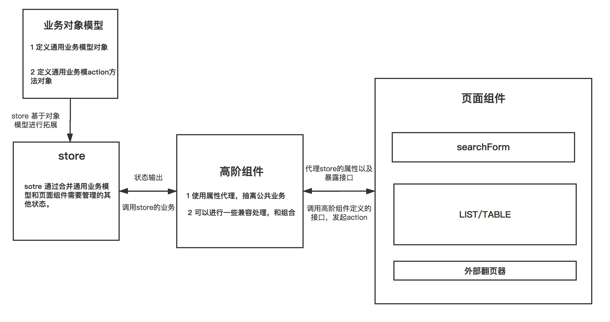

# 中后台项目 - 查询表格业务最佳实践

## 前言

查询表格业务是中后台系统最常用的业务系统之一，我相信该业务场景会在你的项目中会大量出现。既然该此场景在项目中大量的出现，所以对其进行必要的封装会极大的提升业务的复用性以及项目的可维护性。以下是不采取封装可能会带来的问题。

- 会出现大量重复的业务代码
- 不同开发人员对公共业务实现的 方式/命名 不同
- 在 store 层，不同的开发人员可能会定义不同的数据模型
- 相同业务的代码分散，不利于形成良好的开发规范

以上的几点总结起来就是不利于项目的维护和形成规范。

## 查询表格业务 - 设计思路

该业务场景如此常见，所有相信大家都有自己的实现。所以这里仅仅是提出一个设计思路，你可以用来参考案然后考虑是否对你的项目有帮助。设计图如下；



## HOC 定义公共业务接口，预留插槽

这里会在 HOC 中绑定到 Store

```
const TableHoc = config => (WrappedComponent) => {
  const {
    store, // 绑定 store
    className,
    NoPager, // 是否需要外置翻页器
    noNeedReloadPathname = [], // 不需要重新加载数据的返回页面
    dealFormatData = data => data, // 清理列表数据方法
  } = config || {};

  @inject(store)
  @observer
  class BaseTable extends Component {
    static defaultProps = {
      fixClass: 'baseTable-wrapper',
    };

    static propTypes = {
      fixClass: PropTypes.string,
      className: PropTypes.string,
      location: PropTypes.object.isRequired,
      match: PropTypes.object.isRequired,
    };

    componentDidMount() {
      const {
        match: { params: { id } = {} },
        location: { pathname },
      } = this.props;
      /* eslint-disable */
      const {
        tableData: { count, needReload },
      } = this.props[store];

      const preLocation = window.RouterPathname.find((item) => item !== pathname); // [preLocation, curLocation]

      const noNeedReloadTag = !preLocation
        ? false
        : noNeedReloadPathname.some((item) => {
            return preLocation.startsWith(item);
          });

      // 数据没有更新使用缓存数据
      if (count !== 0 && !needReload && noNeedReloadTag) {
        return null;
      }

      if (id) {
        // 如果根据路由获取 id 则拿 id 进行调用
        this.props[store].getData({ id });
      } else {
        this.props[store].getData();
      }
      return null;
    }

    /**
     * 顶部搜索 接口
     * 具体实现在 store 中
     */
    handleSearch = (values) => {
      this.props[store].handleSearch(values); // eslint-disable-line
    };

    /**
     * 重置搜索 接口
     * 具体实现在 store 中
     */
    handleResetSearch = () => {
      this.props[store].handleResetSearch(); // eslint-disable-line
    };

    /**
     * 翻页 接口
     * 具体实现在 store 中
     */
    handlePageChange = (page) => {
      this.props[store].handlePageChange(page); // eslint-disable-line
    };

    /**
     * 改变pageSize 接口
     * 具体实现在 store 中
     */
    handlePageSizeChange = (page, pageSize) => {
      this.props[store].handlePageSizeChange(page, pageSize); // eslint-disable-line
    };

    /**
     * 排序 接口
     * 具体实现在 store 中
     */
    handleSort = (data) => {
      this.props[store].handleSort(data); // eslint-disable-line
    };

    render() {
      const { fixClass } = this.props;
      // 传递 Store， 让页面能够调用 Store 中的自定义方法
      const Store = this.props[store]; // eslint-disable-line
      const { tableData: data } = Store;
      const tableData = toJS(data);
      const classes = classnames(fixClass, { [className]: className });

      const { loading, count, listItems, pageNo, pageSize, query } = tableData;

      const formatData = dealFormatData(listItems);

      return (
        <div className={classes}>
          <WrappedComponent
            loading={loading}
            query={query}
            tableData={formatData}
            handleSort={this.handleSort}
            handleSearch={this.handleSearch}
            handleResetSearch={this.handleResetSearch}
            store={Store}
            {...this.props}
          />

          {NoPager ? null : (
            <div className="pagWrapper">
              <Pagination
                showQuickJumper
                showSizeChanger
                showTotal={() => `共 ${count} 条`}
                onChange={this.handlePageChange}
                onShowSizeChange={this.handlePageSizeChange}
                current={pageNo}
                total={count}
                pageSize={pageSize}
              />
            </div>
          )}
        </div>
      );
    }
  }

  return BaseTable;
};
```

### 定义查询表格通用数据接口

通过高阶组件属性代理：统一项目对于此类场景的具体调用方法。

- 搜索
- 筛选
- 翻页
- 改变每页条目
- 排序
- 重置
- 配置可显示列

### 预留插槽

通过传入 hoc 一些用户自定义处理方法

例如：
- 传入映射函数，兼容表格 column 的展示
- 传入数据清理函数，清洗后端返回的数据，通过属性代理传播

## 定义公共业务模型
⚠️ 本文是基于`mobx`进行数据流管理。redux管理的是纯JavaScript对象，应该更容易实现公共模型的抽离。

```
class TableModel {
  constructor({ pageSize = 10 } = {}) {
    this.tableData = {
      loading: false, // 加载数据状态
      count: 0, // 数据条目
      pageNo: 1, // 当前页码
      pageSize, // 单页数据条目
      listItems: [], // 数据条目 id 集合
      byId: {}, // 数据条目的映射
      query: {}, // 其他请求参数对象
      errorMessage: undefined, // 错误信息
      needReload: false, 数据是否需要重新加载，用于数据缓存优化
    };
  }
  
  // 获取请求参数
  getParams(data) {
    return {
      pageNo: this.pageNo,
      pageSize: this.pageSize,
      ...this.query,
      ...data,
    };
  }
}
```

该模型是比较好的实践，具有普遍通用性; 
- 通过 listItems 和 byId。扁平化数据集合。
- query 拓展可选的请求参数。
- needReload，可以控制是否需要重新拉去数据

## 定义项目Store

```
class Table {
  @observable
  tableData;

  /**
   * more observable to add
   */

  constructor(Model) {
    this.tableModel = new Model(); // 之前定义的模型
    this.tableData = this.tableModel.tableData;
  }

  @action
  handleSearch(values) {
    const params = Object.assign(values, { pageNo: 1 });
    this.getData(this.tableModel.getParams(params));
  }

  @action
  handleResetSearch() {
    this.getData({
      pageNo: 1,
      grade: undefined,
      name: undefined,
      startTime: undefined,
      endTime: undefined,
    });
  }

  @action
  handlePageChange(pageNo) {
    this.getData(this.tableModel.getParams({ pageNo }));
  }

  @action
  handlePageSizeChange(pageNo, pageSize) {
    this.getData(this.tableModel.getParams({ pageNo, pageSize }));
  }

  @action
  getData({
    name = undefined,
    grade = undefined,
    pageNo = 1,
    pageSize = 10,
    startTime = undefined,
    endTime = undefined,
  } = {}) {
    this.tableData.loading = true;
    api
      .initTableData({
        params: {
          name,
          grade,
          pageNo,
          itemsPerPage: pageSize,
          startTime,
          endTime,
        },
      })
      .then((resp) => {
        const { count, items: listItems } = resp;
        const byId = listItems.map(item => item.id);

        this.tableData = {
          loading: false,
          pageNo: pageNo || this.tableData.pageNo,
          pageSize: pageSize || this.tableData.pageSize,
          count,
          listItems,
          byId,
          errorMessage: undefined,
          needReload: false,
          query: {
            grade,
            name,
            startTime,
            endTime,
          },
        };
      });
  }

  /**
   * more action to add
   */

}
```

## 页面组件

这里的页面组件当然是作为一个容器组件，内部通常包含；

- 搜索表单
- 列表
- 外部翻页器
- other

`组件开发的一种思想`，展示性组件对于同一调用通常会有不同实现。基于降低组件的耦合度，通常只会定义调用接口具体实现由外部实现。

这里的页面组件会实现除公共业务以外的所有实现，同时也可以拓展其他store不调用定义好的业务。

### 搜索表单

- 表单接受 query， query 会填充到表单
- 搜索回调 返回搜索参数
- 重置回调

### 列表

- 接受listItems 数据集合
- 跳转回调
- 打开 modal 回调
- other 自定义回调

### 外部翻页器

如果你自定义了列表，并且内部没有封装翻页器，就是用外部翻页器。

```
// 可以使用缓存数据的返回页面
const noNeedReloadPathname = ['/form/baseForm', '/detail/baseDetail/'];

// dealFormatData -> 清理列表数据方法
@TableHoc({ store: 'TableStore', dealFormatData, noNeedReloadPathname })
class SearchTable extends Component {
  static defaultProps = {
    titleValue: ['本次推广专属小程序二维码', '本次推广专属小程序链接'],
  };

  static propTypes = {
    loading: PropTypes.bool,
    tableData: PropTypes.array, // 表格数据
    query: PropTypes.object, // 表单查询信息
    titleValue: PropTypes.array, // 弹窗提示
    store: PropTypes.object, // @TableHoc 高阶组件中绑定的 mobx store 对象
    routerData: PropTypes.object.isRequired, // 路由数据
    history: PropTypes.object.isRequired, // router history
    handleSearch: PropTypes.func.isRequired, // @TableHoc 表单搜索接口
    handleResetSearch: PropTypes.func.isRequired, // @TableHoc 表单重置接口
  };

  constructor(props) {
    super(props);
    this.state = {
      visibleModal: false,
      record: {},
    };
  }

  get columns() {
    return [
      {
        title: '创建时间',
        dataIndex: 'createdAt',
        key: 'createdAt',
      },
      {
        title: '地区',
        dataIndex: 'address',
        key: 'address',
      },
      {
        title: '学校',
        dataIndex: 'school',
        key: 'school',
      },
      {
        title: '年级',
        dataIndex: 'grade',
        key: 'grade',
      },
      {
        title: '班级',
        dataIndex: 'className',
        key: 'className',
      },
      {
        title: '用户数',
        dataIndex: 'registerNumber',
        key: 'registerNumber',
      },
      {
        title: '订单金额',
        dataIndex: 'totalPayMoney',
        key: 'totalPayMoney',
      },
      {
        title: '我的收益',
        dataIndex: 'totalShare',
        key: 'totalShare',
      },
      {
        title: '操作',
        dataIndex: 'action',
        key: 'action',
        width: 155,
        render: (text, record) => {
          const shareStyle = {
            width: 70,
            color: '#1574D4',
            marginRight: 5,
            cursor: 'pointer',
          };
          const detailStyle = {
            width: 70,
            color: '#1574D4',
            marginLeft: 5,
            cursor: 'pointer',
          };
          return (
            <div className="operations-orgGo">
              <span style={shareStyle} onClick={() => this.handleOpenShareModal(record)}>
                立即分享
              </span>
              <span style={detailStyle} onClick={() => this.redirectToDetail(record)}>
                查看详情
              </span>
            </div>
          );
        },
      },
    ];
  }

  redirectToCreatePromotion = () => {
    const {
      history: { push },
    } = this.props;
    push({ pathname: '/form/baseForm' });
  };

  redirectToDetail = (record) => {
    const {
      history: { push },
    } = this.props;
    push({ pathname: `/detail/baseDetail/${record.id}` });
  };

  handleOpenShareModal = (record) => {
    this.setState({
      visibleModal: true,
      record,
    });
    const { store } = this.props;
    store.getWeiCode({ promotionId: record.id, record });
  };

  handleCloseShareModal = () => {
    const { store } = this.props;
    this.setState(
      {
        visibleModal: false,
        record: {},
      },
      () => store.delWeiCode(),
    );
  };

  handleReset = () => {
    const { handleResetSearch } = this.props;
    handleResetSearch();
  };

  handleSearch = (value) => {
    const { timeLimit = [undefined, undefined], grade } = value;
    let { queryCond: name } = value;
    const startTime = timeLimit[0] && timeLimit[0].format('YYYY-MM-DD HH:mm:ss');
    const endTime = timeLimit[1] && timeLimit[1].format('YYYY-MM-DD HH:mm:ss');
    name = name ? name.replace(/^(\s|\u00A0)+/, '').replace(/(\s|\u00A0)+$/, '') : undefined;

    const { handleSearch } = this.props;
    handleSearch({
      startTime,
      endTime,
      name,
      grade: grade || undefined,
    });
  };

  render() {
    const { visibleModal, record } = this.state;

    const {
      routerData: { config },
      titleValue,
      loading,
      tableData,
      query,
    } = this.props;

    return (
      <WithBreadcrumb config={config}>
        <Helmet>
          <title>查询表格 - SPA</title>
          <meta name="description" content="SPA" />
        </Helmet>
        <div className="table-search-wrapper">
          <ModuleLine title="查询表格">
            <Button
              size="middle"
              type="primary"
              className="promotionBtn"
              onClick={this.redirectToCreatePromotion}
            >
              新增
            </Button>
          </ModuleLine>

          <SearchForm
            handleReset={this.handleReset}
            onSubmit={this.handleSearch}
            initialValue={query}
          />
        </div>

        <Table
          bordered
          className="self-table-wrapper"
          loading={loading}
          dataSource={tableData}
          pagination={false}
          columns={this.columns}
        />
        <ShareModal
          key="base-table-modal"
          width={600}
          record={record}
          showTitle={false}
          titleDownImg="保存"
          recordType="string"
          visible={visibleModal}
          titleValue={titleValue}
          handleClose={this.handleCloseShareModal}
        />
      </WithBreadcrumb>
    );
  }
}
```

## 总结

总结一下，这里管理查询列表的所有抽象和模块功能:

- hoc 中定义公共业务接口，并且作为中间层实现一些业务插槽，比如进行数据清理。
- 定义公共模型。抽离该模块的公共状态，使用扁平化数据利于数据缓存。
- 基于公共模型拓展该模块的多有业务和状态。
- 展示型组件，只是更具数据进行展示。业务处理基于回调传递给容器组件，容器组件决定是容器内部实现还是公共业务实现。
- 容器组件，组合公共业务组件和自定义组件。并且可以拓展其他Store。

## 我在项目中的具体实践

- [原文地址](https://github.com/Tianlikai/MyTutorial/issues/6)
- [企业级SPA项目](https://github.com/Tianlikai/mobxSpa)

clone项目，查看项目的 表格页 -> 查询表格
